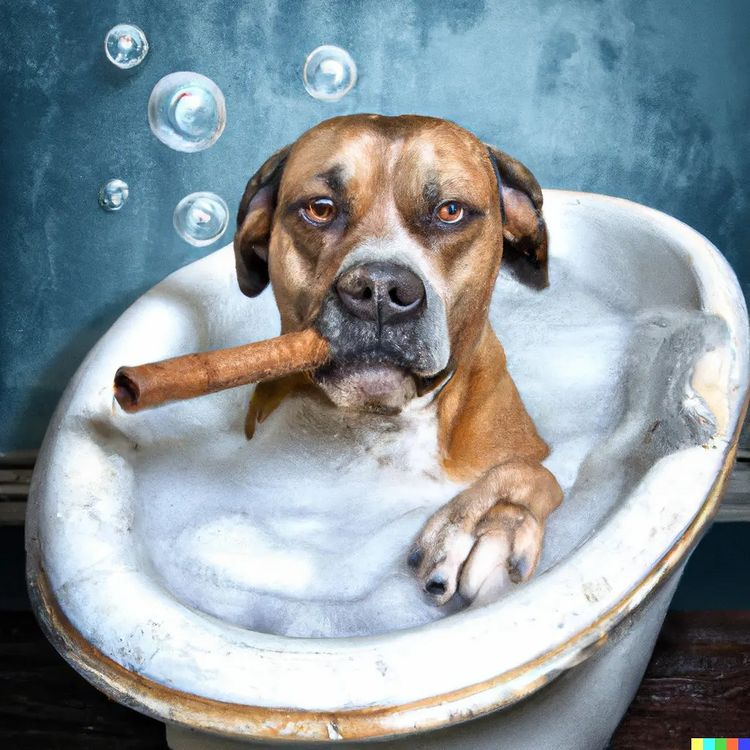

<i class="fa fa-resistance" aria-hidden="true"></i> My name is Vladimir Zaigrajew,

 am a graduate of the Wroclaw University of Science and Technology in Poland with a bachelor’s degree in Computer Science with thesis in AI (2021) and master’s in AI (2022), working on Machine Learning and Computer Vision, with an emphasis on representation learning. I am interested in the field of Artificial Intelligence research, mainly Computer Vision and its applications to real-world problems.
### Education
- **Master of Science in Artificial Intelligence, Wroclaw University of Science and Technology (WUST), Poland** (2021 – 2022) <br /> Thesis Title: Contrastive learning for multi-label classification (accepted for NeurIPS 2022 Workshop). As a participant of AI Tech (government AI, ML and cybersecurity education project), I took part in the WACV 2022 and ICLR 2022 international conferences.
- **Bachelor of Science, Wroclaw University of Science and Technology (WUST), Poland** (2017 – 2021) <br /> Major: Computer Science <br /> Minor: Applied Computer Engineering in Medicine <br /> Thesis Title: Human activity recognition on the basis of changes of WiFi characteristics.


Well that's about it for me. In this blog, I want to showcase some cool projects I'm involved with and maybe some advice/posts for young and mature ML researchers that I don't think are easy to find yet. I also want to encourage new people to fall in love with this field, **let`s destroy the humanity together 😈**. Right now I will simply show some cool samples of what AI can do.

### [Stabble diffusion](https://huggingface.co/spaces/stabilityai/stable-diffusion), [Midjourney](https://midjourney.com/home/?callbackUrl=%2Fapp%2F), [Dalle-2](https://openai.com/dall-e-2/) simply write what you want the picture to contain or be about and Voilà.

Click on the photos to go to their official IG :).

Dogo in bath            |  Cooool interpolation of generated image | Happy Panda
:-------------------------:|:----------------------------------------:|:-------------------------:
[](https://z-p42.www.instagram.com/p/CjysfyeIC6k/) | [](https://www.instagram.com/reel/CkZlQUFLggn/) | [![[panda]](../images/about/panda.jpg)](https://www.instagram.com/p/Cl1LKfrLEOm/)

And now take a look at the new chatbot from OpenAI [ChatGPT](https://chat.openai.com), which writes blogs for me and solves my father's exams at university (well, not all of them).

What I asked: Machine learning funny jokes
```
Why was the machine learning model sad?

Because it was trained on a dataset of depression.
```
```
Why did the deep learning model break up with its girlfriend?

Because it realized it was in a neural network.
```
```
Why did the machine learning model get bad grades in school?

Because it was too busy training on the dataset of failing students.
```
```
Why was the deep learning model so good at solving crimes?

Because it was a real neural detective.
```

What I asked: Write to my professor an email asking where machine learning lecture will be tomorrow.

```
Dear Professor,

I hope this email finds you well. I am writing to inquire about the location of tomorrow's machine learning lecture. I was unable to find the information on the course syllabus or online, and I wanted to confirm the location before the start of the class.

Thank you for your help.

Best regards,
[Your Name]
```

You can even find more interesting ideas, which you can ask this bot about on the Internet.